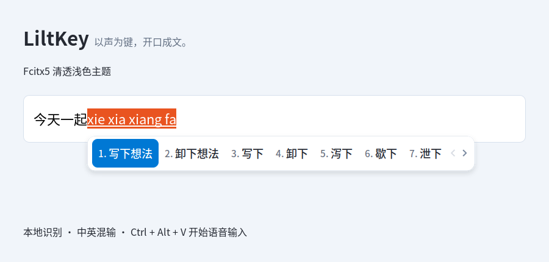

# LiltKey

**Offline voice typing for Linux and Fcitx5.**

English · [简体中文](README.zh-CN.md)

[Website](https://tangzk.github.io/liltkey/) · [License](LICENSE)

Hold `Ctrl+Alt` to talk and release to finish; text appears at the cursor as you speak. Chinese–English mixed dictation and automatic punctuation are supported. Recognition runs on your machine, recordings are never uploaded, and your existing pinyin input keeps working.



*Screenshot of the real Fcitx5 candidate panel in an X11 test text box; voice status uses the same theme.*

> The interface (status messages, notifications, setup prompts) and the detailed docs are currently in Chinese only.

## New in v0.5.0

- Optional SenseVoice refinement keeps streaming drafts visible, then re-recognizes each segment before committing it at a pause or on release.
- Correction failures fall back to streaming recognition; cancellation still discards uncommitted results. All recognition stays on your machine.
- Refinement is **off by default** and needs an additional model. Existing shortcuts and settings are preserved. See [how to enable it](docs/advanced-usage.md#流式预览与快速定稿校正).
- Read the [short model comparison](https://tangzk.github.io/liltkey/research/) for the CPU measurements behind this choice.

## Install

For Ubuntu 26.04 (amd64). Download the [.deb package](https://github.com/tangzk/liltkey/releases/download/v0.5.0/fcitx5-voice_0.5.0_amd64.deb) and install it with the Software app, or run:

```bash
sudo apt install ./fcitx5-voice_0.5.0_amd64.deb
```

The package includes a light theme that is enabled on first setup; existing custom themes, dark preferences and fonts are kept. Default configuration happens automatically after install, with no extra commands. On first run, stay online while about 260 MiB of models download, wait for the “语音输入已就绪” (Voice input is ready) notification, then log out and log back in.

Installation sets Fcitx5 as the default input method and restarts it, keeping your existing pinyin and voice settings. Finish anything you're typing first. Release notes and checksums are on [GitHub Releases](https://github.com/tangzk/liltkey/releases/tag/v0.5.0).

## Usage

In any text box that uses Fcitx5:

| Action | Shortcut |
|---|---|
| Hold to record, release to finish | Hold `Ctrl+Alt` (about 300 ms) |
| Toggle recording on/off | `Ctrl+Alt+V` |
| Discard uncommitted text | `Esc` |

The system microphone is used by default. Text is punctuated and committed when you pause. Holding `Ctrl+Alt` records continuously; releasing either key stops and processes the last sentence. A short press, or pressing another key right after, does not start recording. `Ctrl+Alt+V` still toggles recording, with a 30-second limit per recording in that mode. Committed text is kept.

## More docs (Chinese)

- [Advanced usage and maintenance](docs/advanced-usage.md): microphone, recognition modes, troubleshooting, upgrade and uninstall.
- [Development guide](docs/development.md): build from source, build the deb, tests and upstream projects.
- [Theme and restore](themes/README.md): default theme, switching appearance and restoring your previous settings.
- [Validation notes](docs/validation.md): test results and known limitations.

Original code is licensed under [MIT](LICENSE); third-party software and models keep their own licenses. See [third-party notices](THIRD_PARTY_NOTICES.md) and [model licenses](MODEL_LICENSES.md).
